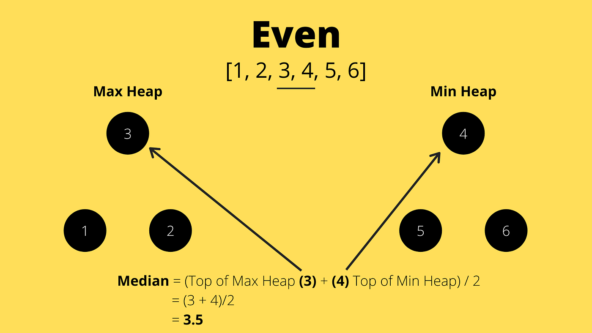

#如何取得中位數
使用兩個head 
maxheap 存較小的左半邊 top() 會是較小中的最大的 
minheap 存較大的右半邊 top() 會是較大中的最大的
left.size() == right.size or left.size() == right.size+1
left.top() <= right.top()
ex 以window [-1 1 3] 及 [2 4 6 8]
[-1 1] [3] => 中位數是 left.top()
[2 4] [8 6] => 中位數就是 (left.top() + right.top()) / 2

# 視窗滑動
加進一個新數
left.size() == right.size or left.size() == right.size+1
left.top() <= right.top()
if new <= left.top() 放left else 放 right
移除一個舊數
重新調整兩個heap到合法狀態

# 完整流程圖
初始化兩個 heap
for i in range(nums):
    加 nums[i]
    balance()

    if i >= k:
        標記 nums[i-k] 為待刪
        balance()

    if i >= k-1:
        計算中位數

【Sliding Window Median — 一鍵講解稿】

題目：
給一個陣列 nums 和視窗大小 k。
視窗每次往右移一格，輸出每個視窗內的「中位數」。

================================================
一、核心想法（先講這個）
================================================
用「兩個 heap」維護視窗內的數：

left  = Max Heap（放較小的一半）
right = Min Heap（放較大的一半）

目標：
- 中位數永遠在「left.top()」或「左右交界」

================================================
二、三個不變量（Invariant）
================================================
1) 數量關係
   leftSize == rightSize
   或
   leftSize == rightSize + 1

2) 順序關係
   max(left) <= min(right)

3) 中位數取得
   - k 是奇數 → median = left.top()
   - k 是偶數 → median = (left.top() + right.top()) / 2

================================================
三、為什麼要兩個 heap
================================================
排序太慢（每窗 O(k log k)）
heap 可以：
- 插入 O(log k)
- 取 top O(1)

把資料切成「左半 / 右半」，中位數就卡在中間。

================================================
四、每次視窗滑動固定做三件事
================================================
（順序很重要）
視窗滑動固定做三件事
1) insert(new)
2) remove(old)
3) rebalance()

================================================
insert（新數進來）
================================================
目的：只管「方向對不對」，不管 size

規則：
- 若 left 為空 或 new <= left.top → 放 left
- 否則 → 放 right

為什麼不馬上修 size？
因為等一下還會 remove，一次一起修比較乾淨。

================================================
六、remove（舊數滑出去）
================================================
問題：
heap 不能 O(log k) 刪「中間的元素」

解法：延遲刪除（Lazy Deletion）

做法：
- 用 map 記帳：del[x] = 有幾個 x 之後要刪
- 同時更新有效 size（leftSize / rightSize）

重點：
- 不立刻從 heap 刪
- 只是宣告：「這個數不准再算中位數」

================================================
七、為什麼非 top 不刪也沒關係？
================================================
因為：
- median 只用 heap.top()
- rebalance 只會搬 heap.top()

非 top 的幽靈：
- 不參與 median
- 不影響結果
- 等它浮到 top 再刪即可

================================================
八、prune（真的刪）
================================================
prune 的意思：
「只要 heap.top() 是幽靈，就 pop 掉」

while heap 非空 且 top 在 del 裡：
    pop(top)
    del[top]--

目的：
- 確保 top 一定是「活的」

================================================
九、rebalance（修回中位數位置）
================================================
目的：
- 不是為了漂亮
- 是為了「中位數站在正確的位置」

rebalance（修回中位數位置）
規則：
- 如果 leftSize > rightSize + 1
    → 搬 left.top() 到 right
- 如果 leftSize < rightSize
    → 搬 right.top() 到 left

注意：
- 只能搬 top（因為它是左右分界）
- pop 前一定要 prune
- 搬完後 top 可能變幽靈，要再 prune

================================================
十、為什麼 rebalance 只搬 top？
================================================
top 是「左右兩半的邊界」

如果搬非 top：
- 順序會壞
- median 位置會錯

================================================
十一、整體流程（for loop）
================================================
for i = 0 .. n-1
    insert(nums[i])

    if i >= k:
        remove(nums[i-k])

    rebalance()

    if i >= k-1:
        output median

為什麼是 i >= k-1？
因為 index 從 0 開始，
第 k 個元素的 index 是 k-1，
視窗此時才「剛好裝滿」。

================================================
十二、時間與空間複雜度
================================================
- 每一步：O(log k)
- 總時間：O(n log k)
- 空間：O(k)

================================================
十三、30 秒口語版（直接背）
================================================
我用兩個 heap 維護滑動視窗的中位數。
left 是 max-heap 存小的一半，right 是 min-heap 存大的一半，
保持 left 不小於 right 且最多多一個，
所以中位數永遠在 left.top 或左右 top 的平均。
每次滑動我插入新值、延遲刪除舊值、再 rebalance。
因為中位數只看 heap.top，
所以只在 top 時才真的刪除幽靈元素，
整體時間是 O(n log k)。

【End】

【Sliding Window Median 實例（一定需要 rebalance）】

例子：
nums = [1, 3, -1, -3, 5, 3]
k = 3

定義：
left  = Max Heap（小的一半）
right = Min Heap（大的一半）
del[x] = 延遲刪除帳本
leftSize / rightSize = 有效元素數
median 只看 heap.top()

================================================
i = 0，進來的數 = 1
================================================
insert(1)
left = [1]
right = []
視窗未滿 → 不算 median

================================================
i = 1，進來的數 = 3
================================================
insert(3)
3 > left.top(1) → 放 right

left = [1]
right = [3]
視窗未滿 → 不算 median

================================================
i = 2，進來的數 = -1
================================================
insert(-1)
-1 <= left.top(1) → 放 left

left = [1, -1]
right = [3]

視窗形成：[1, 3, -1]
median = left.top = 1

================================================
i = 3，進來的數 = -3
視窗從 [1,3,-1] → [3,-1,-3]
================================================
1. insert(-3)
-3 <= left.top(1) → 放 left

left = [1, -1, -3]
right = [3]

2. remove(1)   // nums[0]
del[1] = 1
1 在 left → leftSize--

prune left：
left.top = 1 且 del[1] > 0 → pop
del[1] 清掉

left = [-1, -3]
right = [3]

3. rebalance
leftSize = 2, rightSize = 1 → OK（不需要搬）

median = left.top = -1

================================================
i = 4，進來的數 = 5
視窗從 [3,-1,-3] → [-1,-3,5]
================================================
1. insert(5)
5 > left.top(-1) → 放 right

left = [-1, -3]
right = [3, 5]

2. remove(3)   // nums[1]
del[3] = 1
3 在 right → rightSize--

prune right：
right.top = 3 且 del[3] > 0 → pop
del[3] 清掉

left = [-1, -3]
right = [5]

3. rebalance
leftSize = 2, rightSize = 1 → OK

median = left.top = -1

================================================
i = 5，進來的數 = 3  
視窗從 [-1,-3,5] → [-3,5,3]
================================================
1. insert(3)
3 > left.top(-1) → 放 right

left = [-1, -3]
right = [3, 5]

2. remove(-1)   // nums[2]
del[-1] = 1
-1 在 left → leftSize--

prune left：
left.top = -1 且 del[-1] > 0 → pop
del[-1] 清掉

left = [-3]
right = [3, 5]

現在：
leftSize = 1
rightSize = 2   右邊比左邊多

3. rebalance
因為 rightSize > leftSize：

→ 搬 right.top() 到 left

搬之前：
right.top = 3

搬之後：
left  = [3, -3]
right = [5]

prune（top 都是活的）

median = left.top = 3

================================================
最終輸出
================================================
[1, -1, -1, 3]

================================================
這一步為什麼一定要 rebalance？
================================================
在 i = 5 時：
- 有效 leftSize = 1
- 有效 rightSize = 2

如果不 rebalance：
- median 會錯誤地取 left.top = -3
- 正確 median 應該是 3

rebalance 的目的：
「把中位數從 right.top 拉回 left.top」

================================================
一句話講解用總結
================================================
當 remove 發生在 left，
而 insert 發生在 right，
就可能讓 right 比 left 多，
這時一定要把 right.top 搬回 left，
否則中位數會跑到錯的 heap。